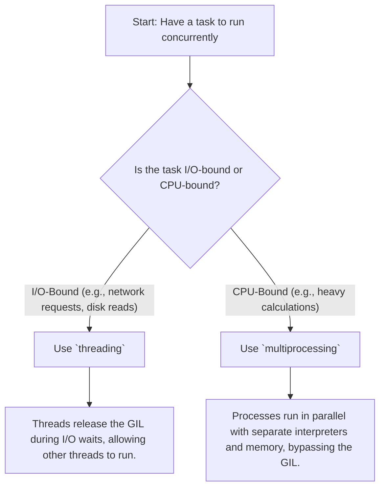

## 📚 Documentation

The complete documentation bundle, including a rich-text version of this guide, a learning roadmap, and supporting references are available on Google Drive.

*   **[Drive Folder: Python's GIL Explained — R&D Lab](https://drive.google.com/drive/folders/1WelMwZ-b5oUExw_V0bywk4McU-ppNoaA)**
*   **[Documentation Bundle](https://docs.google.com/document/d/1T2pzc_aSiEC_VgYicD6GojRDBnxetWNY4s4J0jCzvkM/edit)**

# Python's Global Interpreter Lock (GIL) Explained

This guide explains what the Python Global Interpreter Lock (GIL) is, why it exists, and its practical implications for developers. We'll explore the difference between CPU-bound and I/O-bound tasks and demonstrate how to choose the right concurrency model for your code.

## The Problem: Why Doesn't My Multi-Threaded Code Run Faster?

Have you ever written multi-threaded Python code, expecting a significant performance boost, only to find it runs just as slow—or even slower—than the single-threaded version?

This is a common experience and the reason is the Global Interpreter Lock, or GIL.

## Core Distinction: I/O-Bound vs. CPU-Bound Tasks

Before we discuss the GIL, we must understand the two main types of tasks your program might perform:

*   **I/O-Bound Tasks:** These are tasks that spend most of their time waiting for something to happen. This "something" is often input/output (I/O) operations, like reading a file from a disk, making a network request to an API, or querying a database. The CPU is mostly idle during these waits.
    *   *Analogy:* A chef waiting for water to boil. While waiting, the chef can't do much with that pot, but they are free to perform other tasks like chopping vegetables for a different dish.

*   **CPU-Bound Tasks:** These are tasks that spend most of their time performing computations. The CPU is actively working, executing instructions. Examples include complex mathematical calculations, data processing in memory, or image resizing.
    *   *Analogy:* A chef actively and continuously chopping vegetables. This task requires the chef's full attention and effort; they cannot do another task simultaneously.

## Architecture: Choosing the Right Tool

The key takeaway is to select your concurrency tool based on the type of task. This diagram illustrates the decision-making process.



## The Demonstration: Seeing is Believing

Let's demonstrate this with code.

### 1. I/O-Bound Task: `threading` Shines

Here, we simulate an I/O task by making our function sleep for 1 second. We'll run this task twice sequentially, then twice using threads.

**Code:** `src/io_bound_threading.py`

**Expected Outcome:** The threaded version should be about twice as fast because while one thread is "waiting" (sleeping), the GIL is released, and the other thread can run.

**Actual Terminal Output:**
```
--- Sequential Execution ---
Starting task...
Task finished after 1.00 seconds.
Starting task...
Task finished after 1.00 seconds.
Total time: 2.01 seconds.

--- Threaded Execution ---
Starting task...
Starting task...
Task finished after 1.00 seconds.
Task finished after 1.00 seconds.
Total time: 1.01 seconds.
```
**Conclusion:** As expected, `threading` provided a near-linear speedup for our I/O-bound task.

### 2. CPU-Bound Task: `threading` Fails

Now, let's try the same with a CPU-bound task: a simple, heavy calculation.

**Code:** `src/cpu_bound_threading.py`

**Expected Outcome:** The threaded version will show no speedup. The GIL prevents the threads from executing Python bytecode in parallel on multiple CPU cores.

**Actual Terminal Output:**
```
--- Sequential Execution ---
Starting CPU-bound task...
Task finished after 4.32 seconds.
Starting CPU-bound task...
Task finished after 4.31 seconds.
Total time: 8.63 seconds.

--- Threaded Execution ---
Starting CPU-bound task...
Starting CPU-bound task...
Task finished after 4.35 seconds.
Task finished after 4.35 seconds.
Total time: 8.71 seconds.
```
**Conclusion:** The threaded version took roughly the same amount of time as the sequential one. This is the mystery the GIL explains.

## The Explanation: The "Good Enough" GIL

With the mystery established, let's introduce the culprit.

> **The GIL is a lock that ensures only one thread executes Python bytecode at a time within a single process.**

Its primary purpose is to protect CPython's internal memory management (specifically, its reference counting garbage collection). By preventing race conditions at the interpreter level, it simplifies CPython's development and makes it easy to integrate non-thread-safe C libraries, which was a major advantage in Python's early days.

So, why did `threading` work for the I/O task? Because I/O operations in Python's standard library (and many third-party libraries) **release the GIL** before they wait. This allows another thread to acquire the GIL and run while the first one is waiting. For CPU-bound tasks, there is no waiting, so the thread holds the GIL for the duration of its work.

## The Solution: `multiprocessing` for CPU-Bound Tasks

If the GIL prevents threads from achieving true parallelism for CPU-bound code, how do we solve it? We use `multiprocessing`.

The `multiprocessing` module bypasses the GIL by creating separate processes instead of threads. Each process gets its own Python interpreter and memory space, so the GIL from one process doesn't block the others.

**Code:** `src/cpu_bound_multiprocessing.py`

**Expected Outcome:** The multiprocessing version should be about twice as fast, as the two processes can run in parallel on different CPU cores.

**Actual Terminal Output:**
```
--- Multiprocessing Execution ---
Starting CPU-bound task...
Starting CPU-bound task...
Task finished after 4.45 seconds.
Task finished after 4.46 seconds.
Total time: 4.47 seconds.
```
**Conclusion:** We achieved a near-linear speedup for our CPU-bound task by using `multiprocessing`.

## How to Run the Examples

1.  Clone this repository.
2.  Navigate to the `src` directory: `cd src`
3.  Run each script to observe the behavior yourself:
    *   `python io_bound_threading.py`
    *   `python cpu_bound_threading.py`
    *   `python cpu_bound_multiprocessing.py`

## Concepts Covered

*   Global Interpreter Lock (GIL)
*   I/O-Bound vs. CPU-Bound Tasks
*   `threading` for I/O-bound concurrency
*   `multiprocessing` for CPU-bound parallelism
*   Performance measurement with `time.perf_counter`

## The Path Forward: What About `asyncio`?

This guide focuses on the foundational `threading`/`multiprocessing` dichotomy caused by the GIL. However, for modern high-performance I/O, especially in networking applications, the community has largely adopted `asyncio`. `asyncio` provides concurrency without threads using a single-threaded event loop, which can be more efficient and scalable for tens of thousands of connections. Understanding the GIL and its implications is a crucial prerequisite to appreciating why `asyncio` is designed the way it is.

## References

*   [Python Docs: `threading`](https://docs.python.org/3/library/threading.html)
*   [Python Docs: `multiprocessing`](https://docs.python.org/3/library/multiprocessing.html)
*   [Real Python: What Is the Python Global Interpreter Lock (GIL)?](https://realpython.com/python-gil/)
*   [David Beazley: Inside the Python GIL (PyCon 2010)](https://www.youtube.com/watch?v=ph3S232_BPk)
