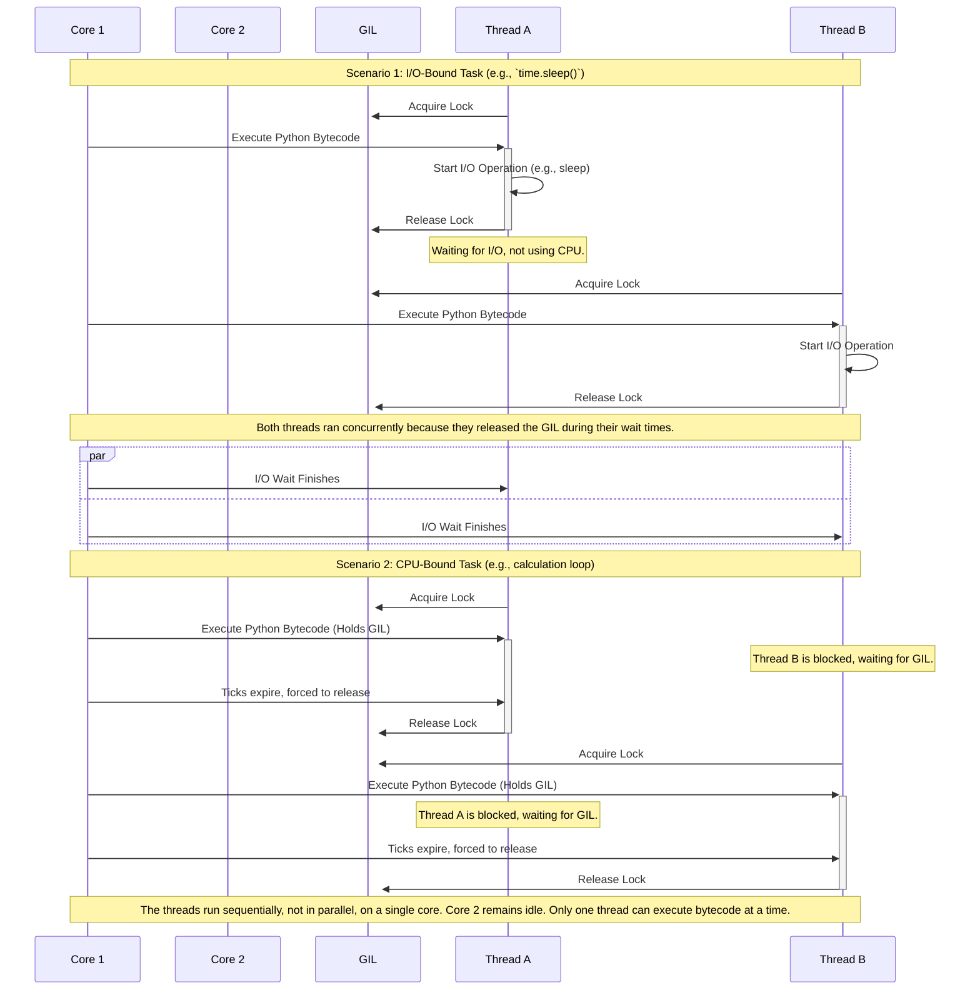

# Architecture Deep Dive: Visualizing the GIL

While the `README.md` provides a high-level overview, this document offers a more detailed look at how the GIL affects thread execution. The key is understanding that "parallelism" in `threading` is an illusion for CPU-bound tasks, but it is very real for I/O-bound tasks.

## The GIL's Execution Flow

The Global Interpreter Lock enforces a strict rule: **only one thread can execute Python bytecode at any given moment.** However, the lock is periodically released.

A thread holding the GIL will release it under two conditions:

1.  **I/O Operations:** When a thread performs an operation that waits for external input/output (like `time.sleep()`, reading a socket, or accessing a file), the standard library releases the GIL. This allows another thread to run.

2.  **Tick Counter:** The Python interpreter maintains a "tick" counter. When a thread has held the GIL for a certain number of ticks (instructions), it is forced to release the GIL, allowing other threads a chance to run. This prevents a single CPU-bound thread from hogging the interpreter indefinitely.

### Sequence Diagram: I/O-Bound vs. CPU-Bound

The following diagram illustrates the execution flow for two threads on a dual-core CPU.

### Implications of the Model

*   **For I/O-Bound Work:** The illusion of parallelism is effective. While one thread is waiting for the network, another can be parsing data. The GIL is released on the I/O call, making `threading` a highly effective tool.

*   **For CPU-Bound Work:** The GIL becomes a bottleneck. Even with 8 CPU cores, only one thread can execute Python code at a time. The context switching forced by the tick counter can even add a small amount of overhead, making the threaded version slightly slower than a simple sequential run. This is why `multiprocessing` is necessary to achieve true parallelism for CPU-intensive computations.
